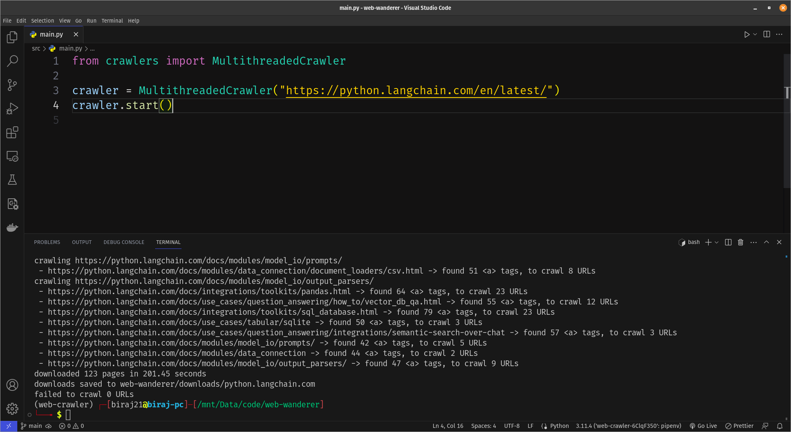

# Web Wanderer

Web Wanderer is a multi-threaded web crawler written in Python, utilizing `concurrent.futures.ThreadPoolExecutor` and Playwright to efficiently crawl and download web pages. This web crawler is designed to handle dynamically rendered websites, making it capable of extracting content from modern web applications.



## How to Use

First install the [required dependencies](#dependencies).

Then you can use it as either a cli tool or as a library.

### 1. As command-line interface

```bash
python src/main.py https://python.langchain.com/en/latest/
```

### 2. As a Library

To start crawling, simply instantiate the `MultithreadedCrawler` class with the seed URL and optional parameters:

```python
from crawlers import MultithreadedCrawler

crawler = MultithreadedCrawler("https://python.langchain.com/en/latest/")
crawler.start()
```

The `MultithreadedCrawler` class is initialized with the following parameters:

- `seed_url` (str): The URL from which the crawling process will begin.
- `output_dir` (str): The directory where the downloaded pages will be stored. By default, the pages are saved in a folder named after the base URL of the seed. Defaults to `web-wanderer/downloads/<base-url-of-seed>"`
- `num_threads` (int): The number of threads the crawler should use. This determines the level of concurrency during the crawling process. Defaults to `8`.
- `done_callback` (Callable | None): A callback function that will be called after crawling is successfully done.

## Features

- **Multi-Threaded:** Web Wanderer employs multi-threading using the `ThreadPoolExecutor`, which allows for concurrent fetching of web pages, making the crawling process faster and more efficient.

- **Dynamic Website Support:** The integration of Playwright enables Web Wanderer to handle dynamically rendered websites, extracting content from modern web applications that rely on JavaScript for rendering.

- **Queue-Based URL Management:** URLs to be crawled are managed using a shared queue, ensuring efficient and organized distribution of tasks among threads.

- **Done Callback:** You have the option to set a callback function that will be executed after the crawling process is successfully completed, allowing you to perform specific actions or analyze the results.

## Dependencies

Web Wanderer relies on the following libraries:

- `playwright`: To handle dynamically rendered websites and interact with web pages.

## Getting Started with Development

_Note: Have only tested this project with **Python 3.11.4**._

1. Clone the repository:

```bash
git clone https://github.com/biraj21/web-wanderer.git
cd web-wanderer
```

2. Install and setup [pipenv](https://pypi.org/project/pipenv/)

3. Active virtual environment

```bash
pipenv shell
```

4. Install dependencies

```bash
pipenv install
```

5. Install headless browser with `playwright`

```bash
playwright install
```

## Planned things

- Replace `pipenv` with `poetry` cuz `pipenv` is shit
- `asyncio` crawler
- `trio` crawler (cuz why not)
- Allow choosing between HTML engine (requests/aiohttp) & JavaScript engine (Playwright)

Will do it when I get time.

List created on 30th Nov, 2024

Happy web crawling with Web Wanderer! 🕸️🚀
